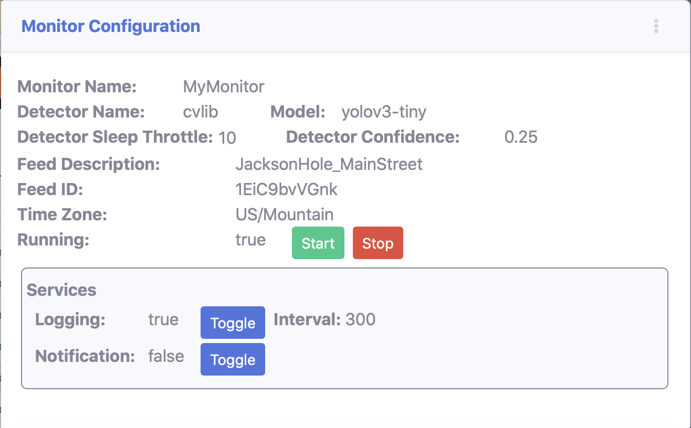

Traffic Monitor
===============

Project documentation is available in a navigable format with API reference details at the project's Git Project Page: http://mcdomx.github.io/monitor/.

The Traffic Monitor application will detect objects in a video feed and log, report and chart instances of objects that are recognized.  A variety of objects can be selected for tracking as well as the source of the video stream.

Although the application has been designed to accommodate custom object detection algorithms, a single OpenCV implementation of object detection is used with the default dataset of trained COCO objects.

The application will forecast rates of detection based on historical data tracked in the application's database.  Models are retrained daily and the model used to present forecasts can be changed by the user.

.. figure:: images/all_services.png
  :figwidth: 600
  :alt: Monitor Home Screen

  **Monitor Home**: Example home page of a running monitor.

The application supports two basic actions for detected objects; Logging and Monitoring.

Logging
    Logging is the action of storing the counts of detected objects in the video stream.  The resulting log can be used to analyze traffic patterns.

Monitoring
    Monitoring will trigger an action when a defined object is detected in the video stream.  For example, if an elephant is detected, a message can be sent or the frame image can be saved. (Currently, monitoring will only report detected objects to the screen when detected.)

A web font-end provides the most appealing and simple interface to the monitor but the monitor can also be controlled via REST URL calls.

Web Front-End
-------------

At the root (http://localhost:8000/), a series of options are presented to select an existing monitor or create a new one.

Monitor Selection (Landing Page)
^^^^^^^^^^^^^^^^^^^^^^^^^^^^^^^^
.. figure:: images/monitor_selection.png
  :figwidth: 300
  :alt: Monitor Selection

  **Landing Page**: The site's root presents a list of available monitors to select from.  Either a monitor can be selected or created.

Create Monitor
^^^^^^^^^^^^^^
.. figure:: images/create_monitor.png
  :figwidth: 300
  :alt: Create Monitor

  **Create Monitor**: Select a Detector and a Video Feed to define a monitor.  A unique monitor name is required.

Create Video Feed
^^^^^^^^^^^^^^^^^
.. figure:: images/create_video_feed.png
  :figwidth: 300
  :alt: Create Video Feed

  **Create Video Feed**: A feed can be easily created.  Simply provide the URL or the YouTube hash to a stream.  The application will validate the feed and provide a visual preview.  A description is required and the feed's time zone should be identified.

Monitor Home
^^^^^^^^^^^^
.. figure:: images/all_services.png
  :figwidth: 600
  :alt: Monitor Home Screen

  **Monitor Home**: Service activity is shown in separate sections.  Each tile has customized pop-up menu options.

Configuration Tile
^^^^^^^^^^^^^^^^^^

  **Monitor Configuration**: The monitor configuration displays the current values used by the monitor.  As items are changed using each tile's pop-up menus or via the API, these values are updated in the web page.

Download Tile
^^^^^^^^^^^^^

  **Download**: Logged data is stored to the database and can be extracted and downloaded into CSV format by selecting a date range (full range selected by default) and then clicking download.

Detector Tile
^^^^^^^^^^^^^

  **Detector**: Each detected image is displayed.  The popup menu is used to adjust detector sleep time and the level of confidence used.  Increasing sleep time will reduce the burden on the CPU.

Chart Tile
^^^^^^^^^^
.. figure:: images/chart_service.png
  :figwidth: 300
  :alt: Chart

  **Chart**: At each log interval the chart is updated.  The popup menu can be used to open a new tab with a larger chart and larger time range.  The range of dates displayed can be adjusted with the slider and the charted objects can be toggled with the drop down menu.  Forecasts can be made using trained models available in the drop down button.

Logging Tile
^^^^^^^^^^^^
.. figure:: images/log_service.png
  :figwidth: 300
  :alt: Log

  **Log**: Logged items are presented with the most recently logged item first.  Items shown are items that have been added to the database.  Using the popup menu, logged items can be toggled and the interval used to log items to the database can be adjusted.

Notification Tile
^^^^^^^^^^^^^^^^^
.. figure:: images/notification_service.png
  :figwidth: 300
  :alt: Notification

  **Notification**: Notified items are shown with the time that they were identified by the detector.  These items are not stored in the database.  The popup menu can be used to toggle the items that are presented in the notification log.

API
---
The application supports an API which can be used to setup, configure, start and stop monitors.  See the API documentation for details. (:ref:`API Reference`)

Architecture
------------
The application uses Django to publish pages and handle API requests.  A Postgres database is used to store configuration information as well as data collected by the Monitor.  In an effort to structure the application so that it can later be converted to a series of microservices, the Postgres database is run in a Docker container.

Communications
    Back-end (Kafka)
        Application components communicate across the Django backend using Kafka.

    Back-end > Front-end (Websockets)
        The Django back-end communicates with web clients using WebSockets.

    Front-end > Back-end (REST API)
        The front-end web clients communicate to the Django backend using various supported API calls.

Services
    The application is designed as a series of services.  This approach was chosen in an effort to convert the services to micro-services in the future.  5 services are defined which are designed to operate independently:

1. Monitor Service
    This is the primary service that is necessary for any other service to operate.  The Monitor Service will initiate the video stream and other services that are configured for the monitor.  This service serves as the top-level coordinator for a Monitor and its supporting services.

    The monitor service runs as a thread, so an instantiated service is a one-time object.  Once the thread is stopped, it cannot be restarted and will be destroyed.  A new instance of the service is instantiated each time the service is restarted.  Configurations for the service are persistent and stored in the database, so new instances of the Monitor will have the same settings as the last time the monitor was used.

2. Video Detection Service
    This is the service that will capture images from a video stream and will deliver them to a Detector Machine where object detection is performed.  The application is designed so that this service can be replaced by another custom class that may perform detections on other sources of data such as an audio stream or a text stream.  The application currently only supports video detection.

    This Video Detection Service will start a Detector Machine which performs the work of extracting data from the video stream.

3. Log Service
    The Log Service will collect data from a detector through Kafka messages and subsequently store the logged data into the application's database. Logged data can be used later to create models which can predict future appearance of objects or simply used to identify traffic patterns.  A detector may be capable of detecting a long list of objects, but the Log Service can be configured to store a subset of items from the detector.  By default, the Log Service will write to the database each minute, but this frequency can be changed.

4. Chart Service
    The Chart Service provides a Bokeh chart of the monitor's data.  This service is configured as a separate free-standing application hosted in a separate Docker container.

5. Notification Service
    The Notification service will perform a notification action (alert, email, text message, etc) based on the presence of a particular object detected in the video stream.  Where logging will record each instance of a detected object, the Notification Service will broadcast a notification the moment that an object is detected.  This service can be used as an 'alarm' or 'alert'; for example, if there is an elephant in your front yard.

    NOTE: The current version of the application only supports the logging of notification objects which includes the object and the time that it was detected.  Full implementation of this service is reserved for a future release.

Getting Started
===============

The first step is to clone the GitHub repo for this project:

::

    git clone https://github.com/mcdomx/monitor.git

This will copy the relevant project folders and files into a new folder called ``monitor``.  This folder will be referred to as the 'project root' in the documentation below.

Virtual Environment
-------------------
Pipenv is used to manage a virtual environment for this application.  Before launching the virtual environment, Pipenv must be installed locally:

::

    pip install pipenv

Once Pipenv is installed, the virtual environment can be launched from the project root directory:

::

    pipenv shell

This will use the application's ``Pipfile`` to load necessary libraries and modules.

The commands listed below assume that you are working in this virtual environment.

Environment Setup
-----------------

The application relies on a ``.env`` file in the root.  The creation of this file is simplified by running the following command from the project root:
::

    python manage.py create_env

The notes below explain what is in the ``.env`` file, but if you used the command above to create the file, no additional environment steps are necessary to run the application.

Th ``.env`` file includes the following variables:

*optional variables:*
::

    export VERBOSITY=INFO

*required variables:*
::

    export DB_NAME=monitor_db  # name of database
    export DB_USER=monuser  # username of database
    export DB_PASSWORD=password  # user password of database
    export DB_HOST=0.0.0.0  # IP address of database (0.0.0.0 for Docker)
    export DJANGO_SECRET_KEY='<<gobblty_snobblty>>'  # Django secret key (can be anything)

The variables defined in the ``.env`` file will be included in the environment available in Django and accessible using:

::

    local_variable_name = os.getenv("<env_varibale_name>", "<default_if_not_found")

Database, Messaging, Charting and Forecasting Services
-----------------------------------------

The application relies on a Postgres database as well as Kafka for messaging. Postgres is used as the database because the default SQLite database used by Django does not allow concurrent read/write requests which can happen in this application.

Charting is supported in a docker container that runs a Bokeh server.  The web front-end is designed to communicate with the REST-based urls that return an interactive chart of the monitor's data.  Chart data will dynamically be updated while the detector is running.

Forecasting is also a Dockerized application that runs along with the database and the charting service.  Values for forecasting are retrieved from the database and the forecasted data is retrieved by the charting service to plot the forecasts.

All of these services are configured to run in docker containers in this application.  To start the Docker containers, run the following from the project’s ``infrastructure`` directory:

::

    docker-compose up
    docker-compose -f docker-compose-charting.yml up

The first compose file will start the database and communications servives.  The second file will launch the charting and forecasting services.

Any data stored in these services will persist locally and will be available the next time that you start the containers from the same machine.

Initialize Database
^^^^^^^^^^^^^^^^^^^
The first time that you start the database, it will need to be initialized with Django.

-  Run the following Django commands to setup the database from the project root directory:

::

    python manage.py migrate
    python manage.py createsuperuser
    python manage.py setup_database

Stopping the Database and Kafka Containers
^^^^^^^^^^^^^^^^^^^^^^^^^^^^^^^^^^^^^^^^^^
To stop both the database and Kafka containers:

-  Run the following from the ``infratructure`` directory:

::

    docker-compose down

Deleting the Database
^^^^^^^^^^^^^^^^^^^^^
In the event that you want to delete the database and start over, follow the steps below.

::

   docker-compose down
   docker volume remove infrastructure_monitor_data

-  Delete all migrations in the ``migrations`` directory.

Changing the Database and Kafka Configuration
^^^^^^^^^^^^^^^^^^^^^^^^^^^^^^^^^^^^^^^^^^^^^
Changes to the Postgres or Kafka services can be made by updating the docker-compose.yaml file:

-  Update variables and values in the ``docker-compose.yaml`` file in
   the ``infrastructure`` directory.

Start Application
-----------------
Although the supporting services are dockerized, the application that combines the services is not (yet).  After starting the service containers using their docker-compose files, the main Django  application can be started:

::

    python manage.py runserver

Using this command, the application will be published to http://127.0.0.1:8000.

Alternatively, you can define the IP address and port used by the application.  If you set the IP address t the host computer's IP address, you will be able to access the application from any machine on the local network:

::

    python manage.py runserver 10.0.0.1:12345

