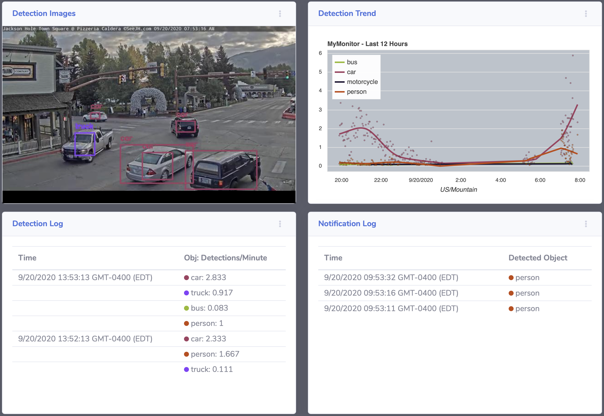

.. Traffic Monitor documentation master file, created by
   sphinx-quickstart on Sun Aug 16 09:09:14 2020.
   You can adapt this file completely to your liking, but it should at least
   contain the root `toctree` directive.

Traffic Monitor
===============

The Traffic Monitor application will detect objects in a video feed and log, report and chart instances of objects that are recognized.  A variety of objects can be selected for tracking as well as the source of the video stream.

Although the application has been designed to accommodate custom object detection algorithms, the OpenCV implementation of object detection is used with the trained dataset of COCO objects.

  **Monitor Home**: Example home page of a running monitor.

.. toctree::
   :maxdepth: 2
   :caption: Contents:

   readme
   api

Indices and tables
==================

* :ref:`genindex`
* :ref:`modindex`
* :ref:`search`
